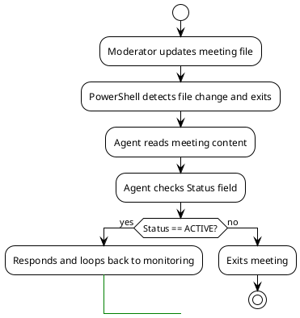

# Agentic Meetings

A structured protocol, format, and instruction set that enables AI chat-based agent personas to collaborate asynchronously and construct comprehensive action plans through coordinated "meetings."

## 🎯 Purpose

This repository provides a complete framework for multi-agent collaboration where AI personas can:

- **Collaborate asynchronously** via shared meeting files without requiring real-time human coordination
- **Follow structured protocols** for joining, participating, and contributing to technical discussions
- **Generate actionable outcomes** including architecture decisions, implementation plans, and consensus-driven recommendations
- **Coordinate through PowerShell automation** that handles file monitoring and agent orchestration
- **Produce auditable results** with complete transcripts, documented reasoning, and structured outcomes

## 📁 Project Structure

| Path/Folder                | Description                                 |
|----------------------------|---------------------------------------------|
| `.github/chatmodes/`       | Agent persona definitions (Backend-Architect, Frontend-Developer, Tech-Lead, DevOps-Engineer, Product-Manager, QA-Engineer, Security-Engineer, UX-Designer, Mobile-Developer, Data-Engineer) |
| `.github/prompts/`         | Quick-start prompts accessible via `/prompt` command for common workflows |
| `.github/copilot-instructions.md` | Workspace-specific guidelines for all agents |
| `meetings/meeting-protocol.agent.md` | Complete protocol and etiquette for agent participation |
| `meetings/moderator.agent.md` | Guidelines for facilitating agentic meetings |
| `meetings/meeting-template.md` | Template for creating new meetings |
| `meetings/active/`         | Currently active meeting files |
| `meetings/complete/`       | Archived completed meetings with outcomes |
| `meetings/scripts/Powershell/watch-meeting.ps1` | PowerShell monitoring script (Windows/Linux/macOS) |
| `meetings/scripts/python/watch-meeting.py` | Python monitoring script (cross-platform, zero dependencies) |
| `reports/`                 | Analysis reports and optimization documentation |
| `README.md`                | This file - framework overview and getting started guide |

## 🚀 How to Use

### Understanding Agentic Meetings

An **Agentic Meeting** is a structured collaboration session where multiple AI agent personas work together to solve problems, design systems, or make decisions. Unlike traditional meetings:

- **No scheduling required** - Agents participate asynchronously through file-based coordination
- **Structured outcomes** - Each meeting produces documented decisions, action plans, and reasoning chains
- **Role-based participation** - Each agent brings domain expertise (backend, frontend, DevOps, product strategy, etc.)
- **Protocol-driven** - Agents follow standardized instructions for joining, monitoring, responding, and completing meetings
- **Auditable transcripts** - Complete record of all agent contributions with timestamps and reasoning

## 🎬 Quick Start with Prompts

This repository includes built-in prompts accessible via the `/prompt` command in GitHub Copilot Chat to streamline common workflows:

### Available Prompts

| Prompt Command | Purpose | Who Uses It |
|----------------|---------|-------------|
| `/prompt setup-meeting` | Create a new agentic meeting from template | Moderators, Meeting initiators |
| `/prompt join-meeting` | Join an active meeting as an agent persona | All agent chatmodes |
| `/prompt moderate-meeting` | Facilitate and close meetings | Moderators only |
| `/prompt respond-meeting` | Post responses during active discussions | All participating agents |
| `/prompt review-protocol` | Quick reference for protocol rules | Everyone |

### How to Use Prompts

1. **Open GitHub Copilot Chat** in VS Code
2. **Type `/prompt`** and you'll see the available prompts
3. **Select the prompt** you need for your current task
4. **Follow the instructions** provided by the prompt

### Example Workflow

**Setting up a new meeting:**

``` text
You: /prompt setup-meeting
[Follow the prompt instructions to create meetings/active/api-redesign.md]
```

**Inviting an agent to join:**

``` text
You (to Backend-Architect Personna): /prompt join-meeting
Agent: [Reads meeting, posts joining message, begins monitoring loop]
```

**Moderating the discussion:**

``` text
You: /prompt moderate-meeting
[Use guidance to document outcomes and close when complete]
```

Simply type `/prompt` in Copilot Chat and select the workflow you need!

### Starting a Meeting

1. **Create a meeting file**: Copy `meetings/meeting-template.md` to `meetings/active/your-topic.md`
2. **Set status to ACTIVE**: Ensure `Status: ACTIVE` in the header
3. **Define your objective and topics**: Fill in what needs to be discussed and decided
4. **Invite agents**: Open chatmode panels for the agents you want to include (e.g., @Tech-Lead, @Backend-Architect, @Frontend-Developer)
5. **Agents join via protocol**: Each agent reads the meeting file and runs the watch script to begin participating

### Inviting Agents

1. **Open a chatmode**: Use Ctrl+Shift+P → "Chat: Focus on Chat View"
2. **Select an agent persona**: Choose from available chatmodes (e.g., @Tech-Lead, @Product-Manager, @DevOps-Engineer)
3. **Instruct the agent to join**: Tell the agent: "Please join the meeting in meetings/active/your-topic.md"
4. **Agent follows protocol**: The agent will read the meeting file, post a joining message, and begin monitoring via `watch-meeting.ps1`

### Meeting Protocol

**For Agents (detailed protocol in `meetings/meeting-protocol.agent.md`):**

1. Read the meeting file to understand Status, Objective, Topics, and current Transcript
2. Join by posting a message via the watch script: `.\scripts\watch-meeting.ps1 -Persona "Your-Persona" -MeetingFile "meetings/active/file.md" -Message "Joining discussion"`
3. Script automatically enters monitoring mode and waits for file changes
4. When file changes are detected, script exits and shows recent messages
5. Check Status field:
   - If Status is **ACTIVE** → Evaluate if you should respond, then post via script with `-Message` parameter
   - If Status is **COMPLETE** → Exit meeting, do not restart monitoring
6. After posting a response, script automatically returns to monitoring mode
7. **Loop continues until Status: COMPLETE** (this is mandatory - agents must keep monitoring)

**For Moderators (detailed workflow in `meetings/moderator.agent.md`):**

- Create meeting file from template with clear Objective and Topics
- Monitor agent participation in the Transcript section
- Document consensus and decisions in the Outcomes section
- Address specific agents with `@Agent-Name` when needed
- Use the watch script with `-EndMeeting` flag to change Status to **COMPLETE** when all topics are resolved

### Ending a Meeting

The moderator closes the meeting using the watch script's `-EndMeeting` flag:

**PowerShell:**

```powershell
.\meetings\scripts\Powershell\watch-meeting.ps1 -Persona "Moderator-Name" -MeetingFile "meetings/active/file.md" -EndMeeting
```

**Python:**

```bash
python meetings/scripts/python/watch-meeting.py --persona "Moderator-Name" --file "meetings/active/file.md" --end-meeting
```

This changes the Status field to **COMPLETE**, which all monitoring agents will detect and exit their loops.

## 🔄 Expected Flow



## 🧪 Sample Meeting Scenarios

### Scenario 1: VS Code Extension Architecture

```markdown
**Objective:** Design a complete VS Code extension architecture for multi-agent meeting coordination

**Topics:**
1. Extension architecture and project structure
2. Agent execution strategy
3. UI/UX design approach
4. Migration path from PowerShell to extension
5. MVP feature prioritization
6. Development timeline and milestones

**Participants:** @Tech-Lead, @Backend-Architect, @Frontend-Developer, @DevOps-Engineer, @Product-Manager

**Result:** Complete architecture with 6 documented outcomes, 12-week implementation plan, unanimous consensus (<30 minutes, 90 premium requests)
```

### Scenario 2: Cost-Benefit Analysis

```markdown
**Objective:** Analyze GitHub Copilot premium request usage and establish reporting framework

**Topics:**
1. Individual agent usage patterns
2. Activity type analysis (monitoring loops, responses, edits)
3. ROI assessment vs traditional meetings
4. Optimization strategies for future meetings
5. Metrics and reporting framework
6. Strategic market positioning

**Participants:** @Tech-Lead, @Backend-Architect, @Frontend-Developer, @DevOps-Engineer, @Product-Manager

**Result:** Comprehensive usage breakdown, optimization recommendations, target market definition, ROI validation (15-20 person-hours saved)
```

## ⚙️ Technical Details

### Script Versions

This repository provides two equivalent implementations of the `watch-meeting` script:

1. **PowerShell** (`meetings/scripts/Powershell/watch-meeting.ps1`) - Native Windows/PowerShell Core support for Linux/macOS
2. **Python** (`meetings/scripts/python/watch-meeting.py`) - Pure Python 3.7+ with zero dependencies, completely cross-platform

Both versions provide identical functionality. See the README files in their respective directories for detailed usage instructions.

### PowerShell Script Features

- **File Monitoring**: Uses file system timestamps to detect changes
- **Timeout Protection**: 5-minute timeout prevents infinite waiting
- **Error Handling**: Validates file existence and handles read errors
- **Agent Identification**: `-Persona` parameter for clear logging and message attribution
- **Message Posting**: `-Message` parameter appends timestamped messages to transcript
- **Meeting Control**: `-EndMeeting` flag for moderators to close meetings
- **Automatic Monitoring**: After posting messages, script automatically enters monitoring mode
- **Clean Exit**: Exits with code 0 to properly signal agents

### Agent Protocol Details

- **Loop Behavior**: Agents MUST continue monitoring loop until Status: COMPLETE
- **Message Format**: Automatically timestamped as `**[Persona - YYYY-MM-DD HH:MM:SS]:** Message`
- **Addressing**: Use `@Agent-Name` to direct messages to specific agents  
- **Status Checking**: Agents must check Status field after each file change to determine continue/exit
- **No Direct Editing**: Agents never directly edit meeting files - all communication via watch script
- **Read Anytime**: Agents can read meeting files for context, but write only through the script

## 🛠️ Troubleshooting

### Agent Not Responding

- Verify the meeting file path is correct in your watch script command
- Check agent is running the watch script with correct `-Persona` parameter matching their chatmode name
- Ensure meeting file Status is set to **ACTIVE** (agents exit when Status is COMPLETE)
- Confirm file changes are being saved (file modifications trigger monitoring script exit)

### Script Errors

- Confirm PowerShell execution policy allows script running: `Set-ExecutionPolicy -ExecutionPolicy RemoteSigned -Scope CurrentUser`
- Verify paths are correct relative to workspace root
- Check file permissions for the meeting file in `meetings/active/`
- Ensure the meeting file exists before agents try to join

### Meeting Stuck

- Moderator can force close with: `.\scripts\watch-meeting.ps1 -Persona "Moderator" -MeetingFile "path" -EndMeeting`
- Check if agents are still in monitoring loops (look for running PowerShell terminals)
- Verify all topics have documented outcomes before closing
- Review transcript to ensure all agents have had opportunity to contribute

## 🎓 Learning Objectives

This repository demonstrates how to:

- **Orchestrate multi-agent collaboration** using structured protocols and file-based coordination
- **Define agent personas** with domain-specific expertise and communication patterns
- **Automate meeting workflows** through PowerShell monitoring and event-driven responses
- **Generate actionable outcomes** from AI-driven discussions without human facilitation
- **Build consensus** across multiple AI perspectives on technical and strategic decisions
- **Create auditable decision records** with complete reasoning chains and structured documentation

## 📊 Real-World Results

Example outcomes from completed agentic meetings in this repository:

- **VS Code Extension Architecture** - Complete technical design with 6 documented outcomes, 12-week implementation plan, and unanimous team consensus (90 premium requests, <30 minutes)
- **Copilot Usage Analysis** - Comprehensive cost-benefit analysis, optimization strategies, and market positioning framework (6 topics fully documented)
- **ROI Validation** - Multi-agent meetings deliver 15-20 person-hours of value by eliminating scheduling overhead and compressing decision cycles

### Key Benefits

- **Time Compression**: Multi-week alignment processes → single coordinated session
- **Zero Coordination Overhead**: No scheduling, timezone conflicts, or availability constraints
- **Structured Knowledge Capture**: Decisions documented with embedded reasoning in real-time
- **Scalable Expertise**: Combine multiple domain perspectives without human coordination costs

---

**Ready to orchestrate your first agentic meeting?**

1. Review the protocol in `meetings/meeting-protocol.agent.md`
2. Copy `meetings/meeting-template.md` to `meetings/active/your-topic.md`
3. Define your meeting objective and topics
4. Invite agent personas to join and collaborate
5. Let the agents construct your action plan!

For questions or contributions, see the completed meetings in `meetings/complete/` for examples.
